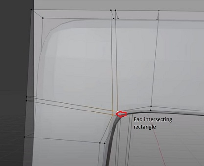

# Blender
###### *2.82a*

## Settings for 3D Printing
- Scene tab in properties panel (cone and circle) > units
  - Unit system: metric
  - Unit scale: 0.001
  - Length: mm
- Overlays in viewport
  - Grid scale: 0.001
- View tab (n)
  - Clip start: 0.01mm
  - End: 10000mm

## Operation
- orbit movement: `middle mouse button, cartesian gizmo in top right`
- zoom: `wheel, plus magnifying glass gizmo in top right`
  - To fix zooming issue: `Edit > Preferences > Navigation > check "Auto Depth"`
- pan left/right/up/down: `shift + middle mouse button, hand gizmo in top right`
- look at view from perfect axis viewpoint: `click one of the axis in the cartesian gizmo`
- look at view from camera viewpoint: `camera gizmo in top right`
- to move camera: `position view > F3 > Align Camera to View` or `n > Lock Camera to View`
- view menu: \`
  includes:
  - view camera
  - focus selected object
  - right
  - left
  - front
  - back
  - top
  - bottom
- turn off grid lines, camera, light, other extras: `"Show Overlays" in top right`
- toggle gizmos: `"Show Gizmo" in top right`
- selection tool types: `w`
- move 3D cursor: `shift + right click`
- cursor menu: `shift + s`
- grab selected object: `g, xyz, or middle mouse to drag along axis, type a number to move specified number of units, alt will reset this stat to default value`
- rotate selected object: `r, xyz for rotation axis, type degrees, alt will reset this stat to default value`
- scale selected object: `s, xyz for direction, alt will reset this stat to default value` or `Object Properties > type in exact scale measurements`
  - for any of these operations, `shift + xyz` can be used to operate on all directions EXCEPT selected direction
- add mesh: `shift + a`
- search for Blender operation: `F3`
- view clipping settings: `n`
- select all: `a`
- deselct all: `alt + a`
- move selected to collection: `m`
- toggle viewport modes: `z`
- create parent of multiple objects: `select all relevant objects (parent object last) > ctrl + p > Object (Keep Transform)` - they will all appear as one object in the Scene Collection
- to select rendering engine: `Render Properties > Render Engine`
- to correct light for render: `Render Properties > Color Management > View Transform > False Color`
- render sampling should be `128`
- rendering process: `View Layer Properties > Denoising Data > Compositing > Check Use Nodes top left > Add Denoise Node > Noisy Image -> Image > Denoising Normal -> Normal > Denoising Albedo -> Albedo > Image -> Image > Render`
- set units (metric, imperial): `Scene Properties > Units`
- duplicate selection: `shift + d`
- join multiple objects: `select objects > ctrl + j`

## Modeling
### Commands
- edit mode: `tab`
- proportional editing: `o`
- to smooth the surface of curved objects:
    1. select object
    1. right click object > Shade Smooth
    1. wrench (Modifier Properties) > Add Modifier > Subdivision Surface
- to give thickness to a mesh:
    1. select object
    1. wrench (Modifier Properties) > Add Modifier > Solidify
- x-ray mode: `"Toggle X-Ray" gizmo in top right`
- create object from a duplicate of selected mesh faces: `p` then `selection`
- to increase vertices on a mesh: `select all vertices > right click > subdivide` - subdivide menu will then appear
- select single row or column of vertices: `alt + left click`
- invert selected vertices: `ctrl + i`
- hide selcted vertices: `h` - usefullness is that hidden vertices will not be affected by proportional editing. 
- show all hidden vertices: `alt + h`
- get vertices and affected vertices to stick to mesh underneath while proportional editing: `enable snap on top` then `Snapping > face > Project Individual Elements`
- extrude: `select > 1 vertex then e`
  - extrusion can be cancelled with `right click` then `g,s,r` can be used to grab, scale(face inset), and rotate respectively
- extrude selected to where cursor is: `ctrl + right click`
- make overlay hug underlying structure better: `solidifier modifier > Crease > Inner > 1`
- loop cut: `ctrl + r > scroll wheel for number of cuts > right click to cancel spatial movement` - creates evenly spaced vertex sets along the body of an object. Works well with proportional editing.
- create face on selected vertices: `select vertices > f`
- to subtract shapes from another shape:
  1. make duplicate of object before applying boolean modifier
  1. add shape that will act as the subtractor
  1. position/scale the subtractor
  1. select shape to keep
  1. modifer properties (wrench)
  1. add modifer
  1. boolean
  1. click eye dropper
  1. select the subtractor
  1. operation > difference
  1. apply boolean modifier
  1. subtractor can be deleted
  1. clean up result
    1. delete all faces that surround the cut
    1. re-fill in the faces to eliminate n-gons
- mirror: 
  1. select object to modify
  1. modifer properties (wrench) > add modifier > mirror
  1. select correct axis in mirror modifier
  1. make loop cuts if necessary to delete all vertices on the side that is being mirrored to
  1. only apply mirror after effects that require mirroring are done
- create new edges and vertices: use knife tool - `k`, `c` will snap cuts to 45 degree angles
- edge slide: `double tap g`
- remove doubles: `select all (a) > right click > merge vertices > by distance` or `alt m > by distance`(this operation has a relative distance adjuster)
- duplicate edge: `select edge > alt + v`
- select vertex/edge/face: `1/2/3`
- if beveling is not working properly, reset normals, scale x,y,z to 1.0, and rotation (object mode: `select object > ctrl + a > rotation and scale` edit mode: `F3 > recalculate normals`)
- circle select: `c`
- check normals: `overlays > face orientation` - red means face is facing the wrong way.
  - Fix normals: `select all > shift + n`
  - manually flip face: `ctrl + shift + n`
- delete edge on a face: `select edge > x > dissolve edges` or `delete edge` - can change on whether the edge was created by a loop cut or not
- merge/combine vertices to eliminate triangle/big vertex joints, `select vertices > alt + m > at last/first` or `snapping > vertex > press ctrl while grabbing vertex to snap to nearest vertex` (will not work if proportional editing is on)
- auto merge verticies if verticies are in the same location

- align selected vertices on axis: `select all vertices > s > xyz > 0` - usually needed after a bevel
- shade smooth force ignore edges: `shade smooth > object data properties (green triangle) > normals > auto smooth` - will not try to smooth edges that include an angle that exceeds the magnitude of the 'Angle' setting
- crease: `shift + e`
- join 2 vertices with edges and vertices: `select 2 vertices with vertex gap between them > j`

### Reference Image
- load reference image: `shift + a > image > reference`

### Technique
#### Mirror Modifier
- if using a subdivision surface modifier make sure mirror modifier is above the subdivision surface modifier 
- make a loop cut down the center of the object in which you want to mirror
- delete 1/2 of mesh
- turn on Clipping in the mirror settings so that 2 halves are joined

#### Subdivision Surface Modifier
- always use the subdivision surface modifier over beveling for curved edges
  - the the subdivision surface modifier will average the shape/look of the mesh between all vertices of the mesh
  - add loop cuts to the mesh to control the averaging to what you want the mesh to look like
  - viewport quality can be increased to show the curvature in better detail
  - make edges sharper by adding loop cuts and dragging them very close to the edges in question
  - to fix rounded edges going around a corner, select edges except 2 edge vertices and `gg` to edge drag and merge
    - in essence, you want only 2 flows of rectangles instead of 3
    
    

#### Solidify Modifier
- should go after mirror and subdivision surface modifiers
- offset:
  - `-1`: thickness will be applied to the inside of the mesh
  - `0`: thickness will be applied evenly to both sides of the mesh
  - `1`: thickness will be applied to the outside of the mesh

## Sculpting
- select item and apply the subdivision modifier
- change brush size: `f`
- change brush strength: `shift + f`
- pull mesh out: `left click + drag` 
- push mesh in: `ctrl + left click + drag` 

## Materials
- color, roughness

## Notes
- The mesh characteristics segments, rings, and vertices can only be modified during the initial mesh creation. Once the object is deselcted, the menu will disappear and the characteristics will be permanent. 
- Modifiers work top to bottom.
- Modifiers can be enabled/disabled in different modes from the modifyer menu.
- If viewport shading solid mode becomes noisy and hard to view, increase the clip start in the view options.
- For cutting screw holes, put a square around the screw hole before cutting. Will help eliminate edge glitches from the subdivision surface modifier.

## Tutorials
Amazing beginner Blender tutorial by [*Blender Guru*](https://www.youtube.com/channel/UCOKHwx1VCdgnxwbjyb9Iu1g) can be found [here](https://www.youtube.com/playlist?list=PLjEaoINr3zgEq0u2MzVgAaHEBt--xLB6U).

Blender modeling tutorial by [*Blender Guru*](https://www.youtube.com/channel/UCOKHwx1VCdgnxwbjyb9Iu1g) can be found [here](https://www.youtube.com/watch?v=Hf2esGA7vCc&list=PLjEaoINr3zgEL9UjPTLWQhLFAK7wVaRMR).
