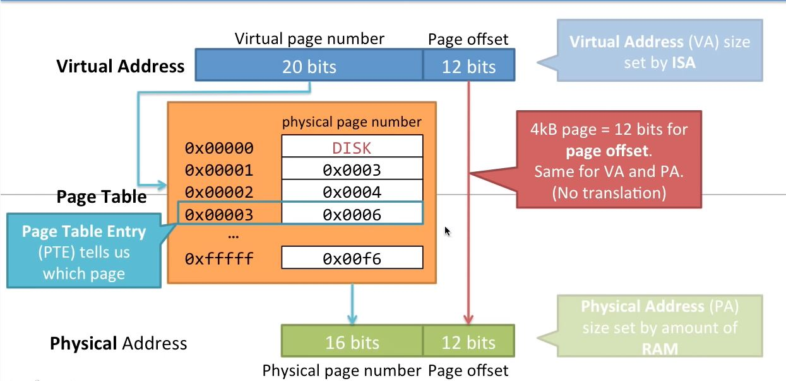
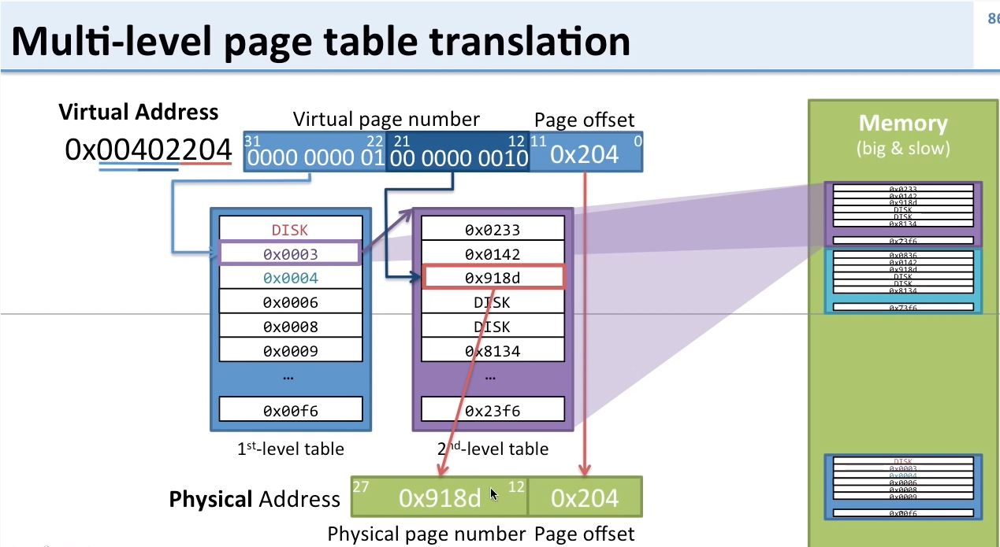

# Computer Architecture
### Computer Architecture and Computer Microarchitecture
- **Computer Architecture (ISA)**: Instruction Set Architecture. The specification of all aspects of the interface between the software and the hardware; for example, instruction formats, opcodes, data types, addressing modes, memory address space, memory addressibility, etc. This allows the software to specify a sequence of operations for the hardware to carry out (the program) and for the hardware to know what each of those instructions is asking it (the hardware) to do. For example: x86, Power-PC, SPARC, MIPS, VAX, Alpha are all ISAs.
- **Computer Microarchitecture (Computer Organization)**: a particular data path and its control that carries out the specification of an ISA. For example, the x86 ISA has been implemented by Intel by the 8086, 386, Pentium, Pentium-Pro, Pentium 4, Pentium M, etc. and by AMD by the Athlon, Opteron, etc.
- **Addressing Modes**: mechanisms for obtaining operands required by an instruction. For example, the LDW instruction obtains the address of the memory location to be accessed by adding an offset to a Base Register. We say the addressing mode is Base+offset. The JSR instruction computes the starting address of the subroutine by adding an offset to the PC. We say the addressing mode is PC-relative.
- **Addressability**: the number of bits stored at each memory location. Most modern computers are byte addressable. That is, 8 bits are stored at each location.
- **Load/Store Architecture**: The term refers to ISAs that require separate load and store instructions to move data to and from memory. That is a load/store ISA does not allow operate instructions to operate on data loaded from memory in the same instruction. Nor, does it allow the result of an operate instruction to be written to memory in the same instruction. So-called RISC ISAs (Arm) were in general Load/Store. So-called CISC ISAs (x86) were in general not.
- **Components of a Processor**: ALU, register file, cache, bus, control store, microarchitectural registers (MAR, MDR, IR, PC, pipeline regs), IO ports

### Virtual Memory
Virtual Memory is memory that a process thinks it has. Generally, the size of the virtual address space. It is a technique that provides an idealized abstraction of the storage resources that are actually available on a given machine which creates the illusion to users of a very large (main) memory. It is a feature of an operating system that enables a computer to be able to compensate shortages of physical memory by transferring pages of data from random access memory to disk storage. This process is done temporarily and is designed to work as a combination of RAM and space on the hard disk. The computer's operating system, using a combination of hardware and software, maps memory addresses used by a program, called virtual addresses, into physical addresses in computer memory. Main storage, as seen by a process or task, appears as a contiguous address space or collection of contiguous segments. The operating system manages virtual address spaces and the assignment of real memory to virtual memory. Address translation hardware in the CPU, often referred to as a memory management unit (MMU), automatically translates virtual addresses to physical addresses. Software within the operating system may extend these capabilities to provide a virtual address space that can exceed the capacity of real memory and thus reference more memory than is physically present in the computer. The primary benefits of virtual memory include freeing applications from having to manage a shared memory space, increased security due to memory isolation, and being able to conceptually use more memory than might be physically available, using the technique of paging.
- VA: virtual address
- PA: physical address
- virtual memory: what the program sees (Eg. `LD R4, 1024` - load data from VA 1024 into R4). All processes have their own VA space. The VA size is set by the ISA.
- physical memory: the physical RAM in the computer
- page table base register: the starting physical address of a page table. Used to compute the address of a PTE. These addresses are managed by the OS and kept in process control blocks. The operating system loads this address into the PTBR whenever a process is dispatched.
- Problems:
    - computer's storage resources should be abstracted from the programmer
    - there are more virtual memory addresses than physical memory addresses, they do not map 1-to-1
    - programs may use the same virtual addresses simultaneously (all processes should have their own VA space)
- Data that cannot fit into RAM is stored on disk

**Virtual Address Translation**



- offset bits: used to index a single page, decided by page size(4KB -> 12 bits, 2MB -> 21 bits, etc.)
- VA most significant bits: indicate the virtual page number
- larger page size -> smaller page table, more data (larger pages) transfered to and from disk
- page fault: Exception that occurs when page is not in RAM. Happens when the PTE points to disk instead of a PA.


- Two-level:
Example scenario:
32-bit machine with 4KB pages.
2^32 / 2^12 = 2^20 = 1M.
So, processes would need page tables with 1M entries, where each entry is 4 bytes, so each page table's size would be 4MB.
Problem: Each program needs its own page table, because each program has its own translation from its own virtual address space to the physical address space. A process's page table must be in memory at all times, they cannot be on disk because if the page table is not in RAM, we cannot access it so we cannot find it. This is going to lead to an issue of too much memory being used up by page tables, in that, if there are 100 running processes, 400MB of space will be used up by page tables.
This problem can be solved with a two-level page table scheme that is used to save space.
Each process will have a 1st level page table and 1024 2nd level page tables.
The 1st level page table has 1024 PTEs that point to 1024 other physical pages that contain page tables that could be in memory or on disk, so its size is 4KB. 1st level page table must always be in memory.
The 2nd level page tables also have 1024 PTEs, so their size is also 4KB. 2nd level page tables can be paged out to disk because we can find them with the 1st level page table.
The worst case scenario is that all 1024 + 1 of a process's page tables are resident, (1024 * 1024) * 4B + 4KB = 4MB + 4KB, but this is unlikely, and most likely a lot of memory will be saved since a lot of the process's page tables will not need to be in memory for the process to run properly.



Great lecture series on virtual memory by [*David Black-Schaffer*](https://www.youtube.com/channel/UCzf_XjIoKSf4Ve2fH7xn-3A) can be found [here](https://www.youtube.com/watch?v=qcBIvnQt0Bw&list=PLiwt1iVUib9s2Uo5BeYmwkDFUh70fJPxX&ab_channel=DavidBlack-Schaffer).

- Thrashing: the condition whereby there is not enough frames of physical memory to hold all the virtual pages that a process needs, resulting in an inordinate amount of time being wasted by pages coming in and going out, only to come in again, etc.
- MMU: a computer hardware unit having all memory references passed through itself, primarily performing the translation of virtual memory addresses to physical addresses. An MMU effectively performs virtual memory management, handling at the same time memory protection, cache control, bus arbitration and, in simpler computer architectures (especially 8-bit systems), bank switching.
- TLB: translation lookaside buffer. It is a cache of PTEs. It allows translation to take place without going through the involved process of "walking" through the page tables. That is, within a fraction of a cycle instead of tens of cycles.
- paging: a memory management scheme by which a computer stores and retrieves data from secondary storage for use in main memory. In this scheme, the operating system retrieves data from secondary storage in same-size blocks called pages. Paging is an important part of virtual memory implementations in modern operating systems, using secondary storage to let programs exceed the size of available physical memory.
OS responsibilities: handling page faults, placing data from disk into RAM and vice versa (paging), creating new PTEs
- Working set - the set of pages that must be resident in order for the process to make reasonable progress
- Balance set - the set of processes that are resident; the set of processes whose working sets are resident
- every process has a page table and a page table base register
- user page tables are stored in system space
- system page table is in physical memory
- each process's page table has a length register. If the page number obtained from the process's VA is greater than the process's page table length register, the VA is invalid.
- process page tables must start from VA 0, and increase until they cover the highest VA used in the process.

### Cache
Cache is a small, very fast piece of memory that sits on the chip. When data in physical memory is needed by the CPU, it is fetched and placed in the CPU's cache. The initial data fetch from physical memory is slow (\~100s of cycles), however the idea behind cache is that, if data is needed once, it will most likely be needed again. This concept is referred to as temporal locality. So now the second time that same data is needed, and the third time and so on, the data will be readily available in the cache, and can be fetched immediately, which means the CPU will not have to access memory. To demonstrate the difference in speed between accessing cache and acessing memory, the following stats describe, generally, the data source latencies for an Intel Core i7:

```
local  L1 CACHE hit,                              ~4 cycles (   2.1 -  1.2 ns )
local  L2 CACHE hit,                             ~10 cycles (   5.3 -  3.0 ns )
local  L3 CACHE hit, line unshared               ~40 cycles (  21.4 - 12.0 ns )
local  L3 CACHE hit, shared line in another core ~65 cycles (  34.8 - 19.5 ns )
local  L3 CACHE hit, modified in another core    ~75 cycles (  40.2 - 22.5 ns )

remote L3 CACHE (Ref: Fig.1 [Pg. 5])        ~100-300 cycles ( 160.7 - 30.0 ns )

local  DRAM                                                   ~60 ns
remote DRAM                                                  ~100 ns
```

It is also helpful to bring in the data surrounding the fetched data, because it is likely that if data is fetched from memory, the surrounding data will also need to be fetched. This is especially true when running programs where the instructions are most likely in sequential order in physical memory. This is called spatial locality. This saves a lot of clock cycles going to memory again and again unnecissarily. The unit of data that a cache will bring in at one time from physical memory is called a cache line or cache block.

First chip with cache: Motorolla 68020. 16 bit machine, cache was 256 bytes, cache lines were 2 bytes (word)

cache consistency/coherency: in a shared memory multiprocessor system, where each processor has its own cache, it is important that the contents of a single location that is stored in multiple caches has the same information in all caches that store that location. If yes, we say the cache is coherent with respect to that location.
snoopy cache: a mechanism for maintaining cache coherency. This is done by allowing each cache to monitor the accesses of other processors to memory so that it knows whether a particular cache line is exclusive to itself or shared with other caches. …or is being written by another processor and so it (this cache) must either invalidate its copy or update it with the value being written by the other processor.
uniprocessor cache consistency: We probably also ought to note here that the rest of the world would call this “coherency” not “consistency.” Normally, we think of cache coherency only when we have more than one processor that can write to its own private cache. We will deal with this more after the exam. It is worth noting however that in a uniprocessor environment with intelligent I/O devices, the I/O device (e.g., DMA controller) can independently write to memory, in which case data in the cache may no longer be valid. Ergo, in an environment with intelligent I/O devices, the cache must monitor independent accesses to memory from the I/O subsystem in order to be sure that data in the cache has not been invalidated by what the I/O device wrote to memory.
write through cache: every write to the cache is also written to memory. In this case, memory and the cache are always consistent. On replacing a block, it is unnecessary to write that line back to memory.
write back cache: writes to the cache do NOT also include writes to memory. Therefore, if a cache line is to replaced, its dirty bit is checked to see whether any writes to that line have occurred since it was brought in from memory. If the dirty bit is set, indicating that writes have occurred, then before the line can be removed from the cache. it has to be written back to memory first.
types of cache:
how to determine cache features:

Snooping:
  - Write Update Snooping Coherence: Example: All writes are required to be broadcasted on the bus so that all cores can snoop, including the value. When core 0 with cache writes to block A, if core 1 with cache also contains block A, core 1 will snoop the bus as core 0 is performing the write, and will update its copy of block A so that core 1's cache does not contain invalid data and can still cache hit on reads to block A. In this way, values stored in cache are always the most up to date. (https://www.youtube.com/watch?v=rLmS02gsEAk)
  - Write Invalidate Snooping Coherence: Example: All writes are required to be broadcasted on the bus so that all cores can snoop, not including the value. (https://www.youtube.com/watch?v=uLikXssApZk&t=18s)

### Pipelining
symbol table: a key-value store of labels and corresponding addresses
reservation station: storage location for an instruction awaiting operands before it can execute.
pipeline stages:
    - instruction fetch
    - decode
    - execute
    - memory access
    - write result to re-order buffer
    - commit result to register file or memory

### Out of Order Execution
purpose: Higher throughput of instructions. It makes use of instruction cycles that would otherwise be wasted. In this paradigm, a processor executes instructions in an order governed by the availability of input data and execution units, rather than by their original order in a program. In doing so, the processor can avoid being idle while waiting for the preceding instruction to complete and can, in the meantime, process the next instructions that are able to run immediately and independently.
retirement (commit, completion): Important in an out-of-order execution machine, where precise exceptions must be maintained. Instructions execute when they are ready, but they must commit their results in the order of the program (in program order) – hence the term “in-order retirement.” We use the word retire or commit to designate that act of permanently changing the destination register.
reorder buffer: A convenient register file that allows destination writes to take place in any order, but reads for the purpose of retirement must be done in program order. Allows easy rollbak of machine state due to exceptions or branch mispredictions. The ROB works by storing instructions in their original fetched order. The ROB can also be accessed from the side since each reservation station (in Tomasulo algorithm) has an additional parameter that points to instruction in the ROB. When jump prediction is not correct or a nonrecoverable exception is encountered in the instruction stream, the ROB is cleared of all instructions and reservation stations are re-initialized.

### Interrupts and Exceptions
internal interrupts: software interrupt
external interrupts: hardware interrupt
exceptions:

### Threads and Processes
thread:
process:

### Floating Point

### IO
memory mapped IO: the characteristic of an ISA wherein there are no separate input and output instructions, but rather all I/O devices are assigned addresses and input and output is accomplished by Loads (input) and Stores (output) to those addresses
DMA: direct memory access. A feature of computer systems that allows certain hardware subsystems to access main system memory (random-access memory) independent of the central processing unit (CPU). Without DMA, when the CPU is using programmed input/output, it is typically fully occupied for the entire duration of the read or write operation, and is thus unavailable to perform other work. With DMA, the CPU first initiates the transfer, then it does other operations while the transfer is in progress, and it finally receives an interrupt from the DMA controller (DMAC) when the operation is done. This feature is useful at any time that the CPU cannot keep up with the rate of data transfer, or when the CPU needs to perform work while waiting for a relatively slow I/O data transfer. Many hardware systems use DMA, including disk drive controllers, graphics cards, network cards and sound cards. DMA is also used for intra-chip data transfer in multi-core processors. Computers that have DMA channels can transfer data to and from devices with much less CPU overhead than computers without DMA channels. Similarly, a processing element inside a multi-core processor can transfer data to and from its local memory without occupying its processor time, allowing computation and data transfer to proceed in parallel. DMA can also be used for "memory to memory" copying or moving of data within memory. DMA can offload expensive memory operations, such as large copies or scatter-gather operations, from the CPU to a dedicated DMA engine. An implementation example is the I/O Acceleration Technology. DMA is of interest in network-on-chip and in-memory computing architectures.

### Branch Prediction
