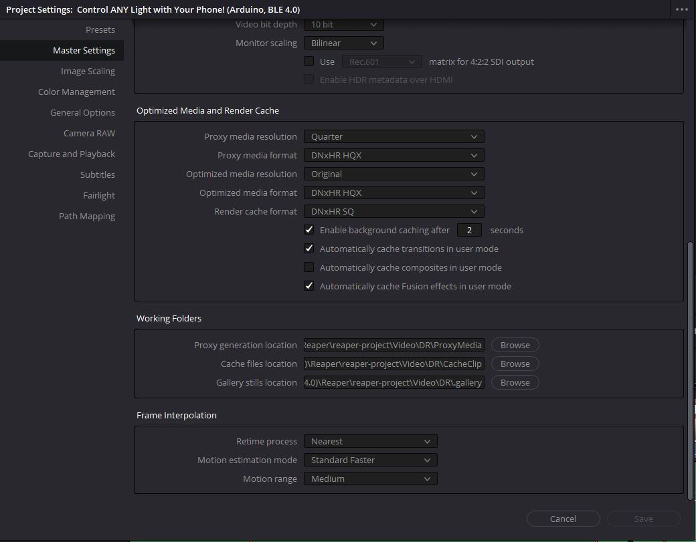

# DaVinci Resolve

## Settings
1. bottom right cog wheel
1. master settings > timeline resolution
1. set timeline and playback frame rate
1. settings can be saved as presets

## Tabs
1. Media: where you import all video footage
1. Cut: for making big cuts in clips
1. Edit: where most editing should happen
1. color: for color correcting
1. fairlight: for audio editing
1. deliver: for exporting video

## Keyboard Shortcuts
- blade tool cursor: `b`
- cut (blade): `ctrl + b`
- remove cut clip and close gap after selecting clip: `shift + del`
- toggle snapping: `n`
- arrow clip select mode: `a`
- ripple edit: `ctrl + shift + [ or ]`
- zoom out in edit tab: `alt + scroll`
- scroll left/right in edit tab: `ctrl + scroll`
- increase height of media items in edit tab: `shift + scroll`

## Text Overlay
- effects library > toolbox > titles > choose and drag a text type onto the timeline > double click the text box in the timeline to bring up the text editor tool

## Video Transitions
- effects library > video transitions > drag and drop transition types to media items in timeline

## Audio
- workspace > show panel in workspace > mixer > will bring up audio mixer for tracks
- fairlight tab can be used for fine tuning audio
- audio should be in the yellow maybe just touching the red
- mono to stereo: right click clip > clip attributes > format > stereo > source channels both on channel 1

## Keyframes (Envelopes)
- place the playback head (main orange bar that you drag around) in the position you want to place a keyframe > add appropriate keyframe type from the box in the top right

## Color Correction
- DaVinci Resolve is known for professional grade color grading quality
- open "color" tab
- open "scopes" panel in the bottom right
  - make sure no color falls outside of the 0-1023 bounds or data will be lost
- lift: will lift entire color spectrum of clip
  - affects dark areas of video
- gain: will lift or drop entire color spectrum of clip
  - affects light areas of video
- gamma: adjusts brightness while keeping all color in lossless range
  - affects midtone areas of video
- saturation: increase = color boosting / decrease = black and white
- to apply color settings of one clip to another: right click video > grab still > will show up in left hand panel > select clip you want it applied to > right click still > apply grade
  - or: select color grade node on the right side > ctrl + c to copy its grade > select clips below to apply grade > ctrl + v to paste

## Export
1. deliver tab
1. choose built in YouTube presets for 4k
1. add to render queue
1. render all

## Caching
- delete all clip cache: playback > delete render cache > all
- to cache a clip: select clip > right click clip > render cache color output

## Proxies
- proxies greatly improve timeline video playback performance
1. file > project settings > master settings > optimized media and render cache:
 
1. edit tab > right click media thumbnail in the left tool bar > generate proxy media
