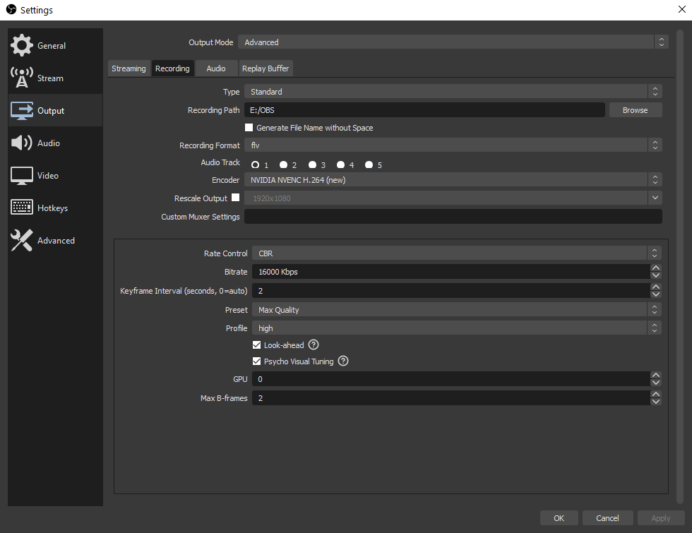
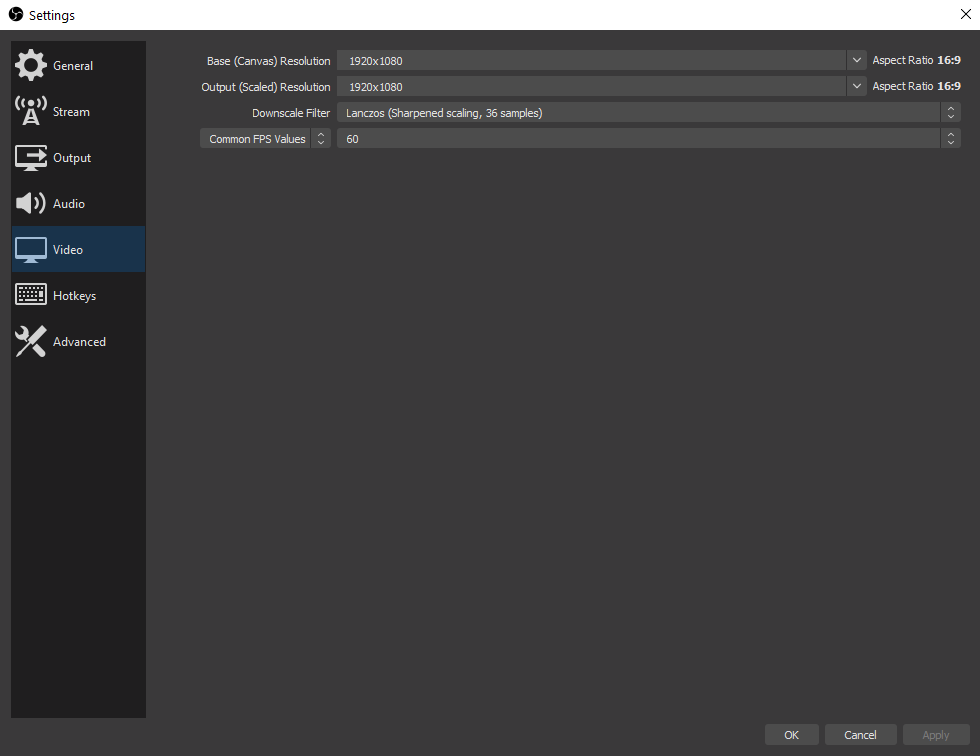
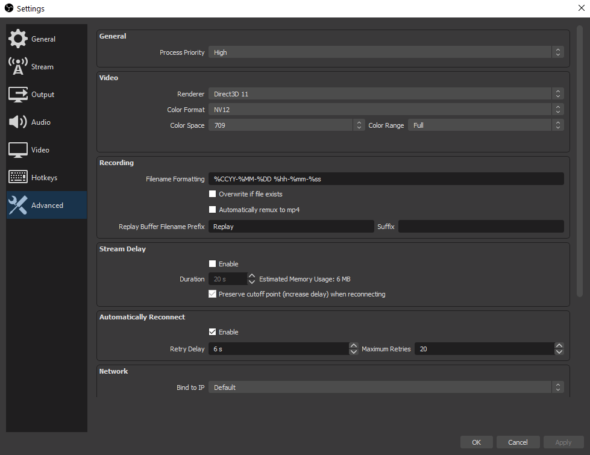
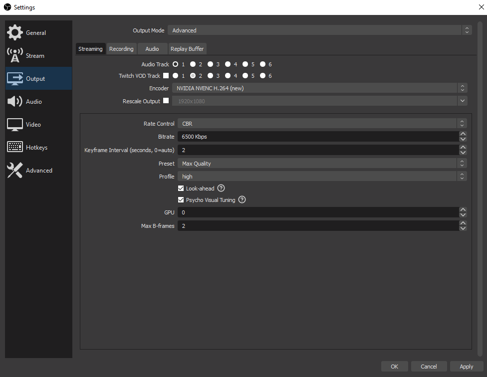
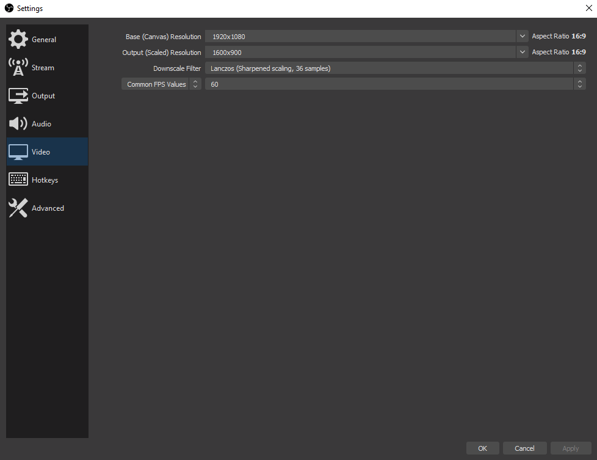
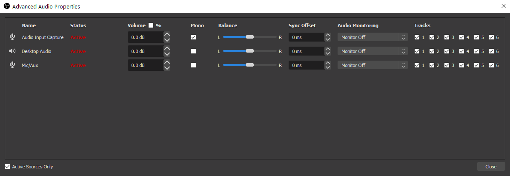

# OBS

## Recording Settings for 1080p/60FPS

## Streaming Settings for 900p/60FPS

## Audio Settings

## Notes
- run OBS in admin mode
- only have 1 monitor connected to PC while recording
- pull up Twitch viewer count: Docks (top bar) > Twitch Stats
