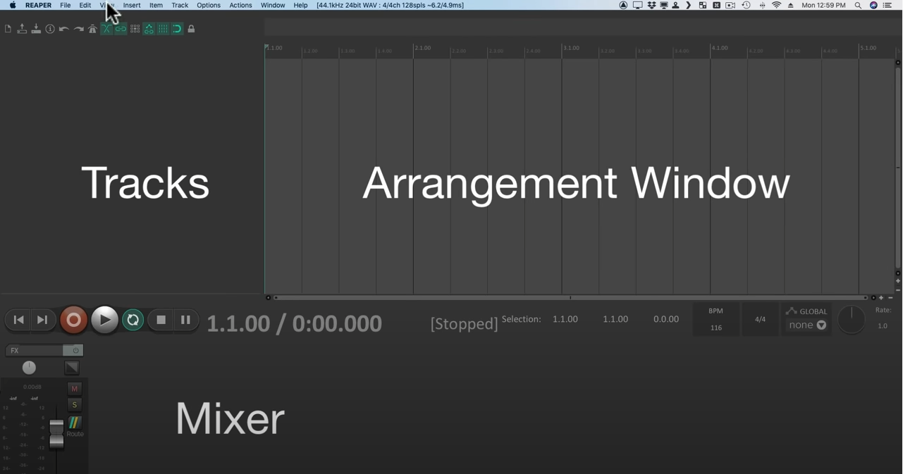
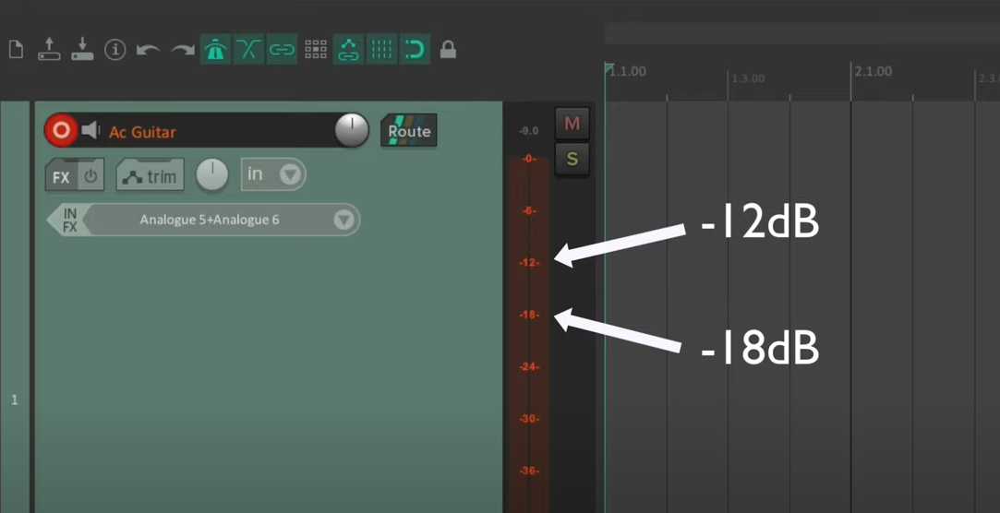

# Reaper

## Why Reaper?
- small and efficient program
  - ~19MB
  - launches very quickly
- has portable install - can be moved from computer to computer, settings preserved, etc. (* Note - input and output devices do not seem to work with the portable install. Might be broken.)
- highly customizable in every way
- regions can be defined in the track
- comes with effects like reverb, delay, MIDI interface, etc. built in
- can do just about anything that any high end, expensive DAW can do

## Intro
- REAPER UI layout
 
- no media track types, any media type can be placed into a track
- tracks can be made into folders that contain many tracks
- snap can be turned on/off in top left bar (sideways horseshoe/magnet)
- fade tracks by hovering mouse on top left or right corners of the media item
- tracks can be faded to the left or right speakers with the left-hand tracks panel
- tempo can be sped up/slowed down in the bottom BPM box. This will only change the playback speed.
- rate can be adjusted in the bottom rate box/dial. This will affect playback speed and pitch.
- themes can be changed: `options > themes`
- a list of all actions available in REAPER is available to view/edit: `actions > show action list...`
- when making a new project, select "Create subdirectory for project" and "Copy all media into project directory"
- tracks can be renamed by double clicking onm the track name area
- track color can be changed by highlighting the track and then: `track > track color` or `right click > track color`
- track volume knobs can be changed to sliders

## Recording
- recording level should be between -12dB and -18dB. To get levels within this range, the gain on the audio interface needs to be adjusted accordingly.
 
- to monitor input EXCEPT when playing back the track, select: `right click track record button > monitor input (tape auto style)`
- if you record into a track that already has content, REAPER will automatically create a new "take", which will be side by side the original take in the track. Select the take that you want to hear on playback. To permanantly choose a take to keep, highlight the take and select: `item > take > crop/delete active take` depending on which take is selected in the track.
- you can zoom into spliced takes and fade/trim them into each other
- if you trim audio, it isn't lost, REAPER keeps it around and you can trim back the other way at any time
- you can automatically punch: `right click record > record mode: auto-punch selected items > make cuts in audio > select items to be replaced > re-record`

## Editing
- REAPER is non-destructive, which means anything you duplicate, delete, etc. in REAPER doesn't affect space/data on the harddrive, only the REAPER program state
- trim: `mouse over left/right side of track item and click and drag`. Item will loop if you trim-extend.
- fade: `mouse over top left/right corner of track item and click and drag`
- stretch/compress: `mouse over left/right side of track item and alt + click and drag`
- move contents inside track item container: `alt + click and drag`
- join splits in items: `select items > item > heal splits in items`

## FX & Plugins
- FX button on all tracks in the tracks panel
- "Cockos": these are REAPER plugins
- each track will have its own FX window
- `shift + f`: brings up FX browser
- effects can be dragged from the FX browser to tracks
- double click effects in the track FX window to give the effect its own window
- FX chains can be saved, and then re-used on any track

## Sends & Busses
- Routing button color codes:
  - **green**: audio is being sent to master send
  - **yellow**: audio is being sent to another non-master track
  - **blue**: track is receiving a send from another track
- to send track audio to another track: `route > add new send > select track to send to`
- when sending audio from one track to another, turn off the original track's "Master Send" so that duplicate audio is not heard: `route > uncheck master send`
- tracks can be sent to other tracks by dragging the track's routing button to another track (you should see a patch cable)
- `alt + click route button`: toggles master send (green band on routing button should toggle)
- it is better to have track effects all on a separate "buss" track. That way, you can have the original track and its effects on different tracks, and send them both to master.

## Commands
- `s`: split an item at cursor
- `edit > undo history` or `ctrl + alt + z`: view undo history
- `ctrl + click in arrangement window`: will place cursor at exact mouse location and not snap to grid
- `shift + f`: brings up FX browser

## Folders
- tracks grouped in folders can all be controlled at once
- effects can be applied to folders

## Track Grouping
- highlight tracks > `shift + g`
- grouping matrix: `view > grouping matrix`

## Markers and Regions
- marker: `m` or `shift + m` - will place a marker at the cursor. Double click marker to give it a name.
- each marker has a marker ID. Use the numbers on the keyboard to jump from marker to marker by marker ID. Bracket keys used to scroll forward/backwards through markers.
- double click between markers to create time selections between them.
- to create a region: `create time selection > right click > create region from time selection` - good for rapid song arrangement/rearrangement
- region/marker manager: `view > region/marker manager`

## Envelopes & Automation
- press "trim" button on the track to open the envelope manager
- to create normal envelopes by hand: `trim > automation mode > trim/read`
- to draw points in the envelope: `hold ctrl and drag`
- to add individual points in the envelope: `shift click`
- points may be dragged around/copy/pasted
- delete point: `alt click`
- select multiple points: `right click + drag`
- adjust level between 2 points: `alt + shift + click and drag` - these two points can be created with time selections and `ctrl + shift`.
- envelopes can be written in real time: `trim > automation mode > write > adjust fader in real time as track is playing` - make sure not to listen to the track back in write automation mode, as it will clobber your envelope work.
- to listen to track and see fader move in real time: `trim > automation mode > read`
